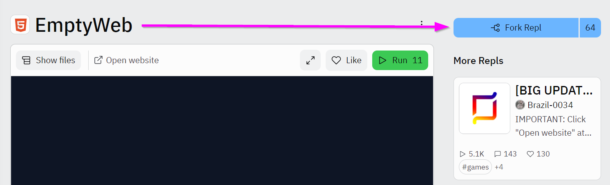

# HTML & CSS Review Code-Along
Start by forking [this empty Repl](https://replit.com/@HylandOutreach/EmptyWeb), then follow the instructions below to build a simple webpage!

To fork the Repl, click the "Fork Repl" button on the page:



## Add the Basic HTML Elements
Add the foundational elements to the **index.html** file. Start with `<html></html>`, then add `<head></head>` and `<body></body>` between the `html` tags.

<input type="checkbox" id="reveal1" class="reveal-checkbox" />
<label for="reveal1" class="reveal-label">👀 Click to Reveal Code 👀</label>

```html
<html>
    <head>
    </head>
    <body>
    </body>
</html>
```

## Add a Main Header
Between the opening and closing `body` tags, add an `h3` element. Within the `h3` element, add the proper text.

<input type="checkbox" id="reveal2" class="reveal-checkbox" />
<label for="reveal2" class="reveal-label">👀 Click to Reveal Code 👀</label>

```html
<h3>Fortnite Fan Site</h3>
```

## Add an Image
Add an image to the page.

1. Go to [Google Images](https://google.com/images/)
1. Find an image, and copy the image address/URL/location
1. Create an `img` element, and set its `src` attribute to be the URL for the image

<input type="checkbox" id="reveal3" class="reveal-checkbox" />
<label for="reveal3" class="reveal-label">👀 Click to Reveal Code 👀</label>

```html

```

## Add a Paragraph about Fortnite
Under the `img` element, add a `p` element that contains the text for the paragraph. Talk about your favorite game: Fortnite.

<input type="checkbox" id="reveal4" class="reveal-checkbox" />
<label for="reveal4" class="reveal-label">👀 Click to Reveal Code 👀</label>

```html
<p>
    Fortnite is a great video game filled with several memorable characters and lots of action.
</p>
```

## Add Another Header
Under the `p`, add an `h3` header... and inside, put `My Favorite Character`.

<input type="checkbox" id="reveal5" class="reveal-checkbox" />
<label for="reveal5" class="reveal-label">👀 Click to Reveal Code 👀</label>

```html
<h3>My Favorite Character</h3>
```

## Add a Paragraph about Your Favorite Character
Under the `h3`, create a `p` element. Between the opening and closing tags, describe your favorite Fortnite character.

<input type="checkbox" id="reveal6" class="reveal-checkbox" />
<label for="reveal6" class="reveal-label">👀 Click to Reveal Code 👀</label>

```html
<p>
    My fave Fortnite character is definitely Drift! He's so cool with his rad moves and sick outfits. I love getting all the skins for him.
</p>
```

## Add a Background Style
Now it's time to add some style. Between the opening and closing `head` tags, add a `style` element.

Add a ruleset to the `style` element that will select the `body` (all the content on the page). Within the ruleset, set the `background` property to `black`, and the `color` property to `white`.

<input type="checkbox" id="reveal7" class="reveal-checkbox" />
<label for="reveal7" class="reveal-label">👀 Click to Reveal Code 👀</label>

```html
<style>
    body {
        background: black;
        color: white;
    }
</style>
```

## Add an Image Style
Currently, the image might be a little big. Use CSS to update its size. Add another ruleset to the `style` element that will select the `img`. Within the ruleset, set the `height` property to `200px`.

<input type="checkbox" id="reveal8" class="reveal-checkbox" />
<label for="reveal8" class="reveal-label">👀 Click to Reveal Code 👀</label>

```css
img {
    height: 200px;
}
```

## Add a Main Header Style
Next, it would be nice for the main header to stand out a little more. To style _only_ the main header, add a `class` attribute to it in the HTML, and then select it by its class in the CSS.

In the **index.html** file, find the top `h3` header. Add a `class` attribute with a value of `shiny` to the element.

<input type="checkbox" id="reveal9" class="reveal-checkbox" />
<label for="reveal9" class="reveal-label">👀 Click to Reveal Code 👀</label>

```html
<h3 class="shiny">Fortnite Fan Site</h3>
```

In the `style` element, add a ruleset that will select elements with a class of `shiny` using `.shiny`. Within the ruleset, set the `color` property to `gold` so that everyone knows you are legendary.

<input type="checkbox" id="reveal10" class="reveal-checkbox" />
<label for="reveal10" class="reveal-label">👀 Click to Reveal Code 👀</label>

```css
.shiny {
    color: gold;
}
```

## Final Code
That's it! The Fortnite Fan Site looks pretty good.

<input type="checkbox" id="reveal11" class="reveal-checkbox" />
<label for="reveal11" class="reveal-label">👀 Click to Reveal Code 👀</label>

```html
<html>
    <head>
        <style>
            body {
                background: black;
                color: white;
            }
            img {
                height: 200px;
            }
            .shiny {
                color: gold;
            }
        </style>
    </head>
    <body>
        <h3 class="shiny">Fortnite Fan Site</h3>
        
        <p>
            Fortnite is a great video game filled with several memorable characters and lots of action.
        </p>
        <h3>My Favorite Character</h3>
        <p>
            My fave Fortnite character is definitely Drift! He's so cool with his rad moves and sick outfits. I love getting all the skins for him.
        </p>
    </body>
</html>
```
