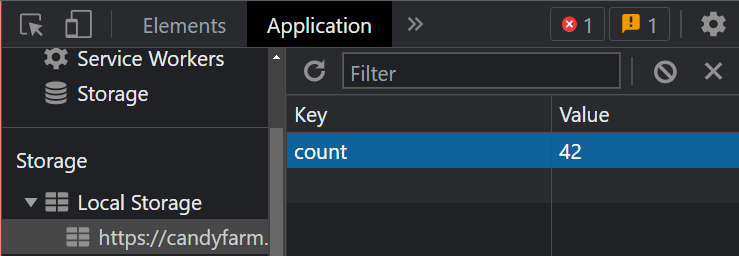

# Self-Paced Work: Candy Farm
Follow these instructions to do some work on a website about candy farming.

[Click here for the starter project.](https://vscodeedu.com/45LBCl4P7GEKXlWvG9CN) Click "Save a copy and edit" to begin.

## Part One: Bug Fixing
Unfortunately, there are some issues on the current site. None of the buttons seem to do anything yet... it's your job to make them functional!

### HTML Issues
Open the **index.html** file to fix the HTML issues.

#### Paragraph Spelling
The third `<p>` element on the page has some questionable grammar. It should say "...how much **candy you have**" instead of "...how much cnady you gots."

#### Broken Button: Show Candy
The **Show Candy** button currently does nothing when it is clicked. That's because the `onclick` for the second `<button>` is calling the wrong function - looks like another spelling issue! Call the properly-spelled function instead.

Once this has been fixed, try clicking the **Show Candy** button. It should display the amount of candy. To make the number go up, try clicking the **Get Candy** button... it should give you more candy when you click the **Show Candy** button again! But it's not quite perfect yet...

### JavaScript Issues
Open the **script.js** file to fix the JavaScript issues.

#### Alert Message Spelling
When clicking the **Show Candy** button, there are some serious issues with the message displayed. It should say **You have this much candy** instead of **You haev tdis many candy** (which looks like a baby typed it). Fix the message in the `alert` that is in the body of the `showCandy` function.

Once this has been fixed, click the **Show Candy** button again - the spelling should be correct, and the amount of candy should still appear.

#### Broken Button: Hi
The **Hi** button currently does nothing when it is clicked. This is an issue with the code on **line 12** in the **script.js** file; the `alert` in the `sayHi` function body does not have a proper string to show.

Once this has been fixed, click the **Hi** button again - a pop-up that says "Hi" should appear.

## Part Two: The `make` Function
For the next part, add functionality to the **Recipe** button. All the HTML is good to go, but it needs some JavaScript! This is all about defining a function in JavaScript.

Open the **script.js** file to begin.

1. Make a new line at the bottom of the file
1. There, _define_ a function named `make`
    - `function`
    - Function Name: `make`
    - Parentheses: `()`
    - Curly Brackets: `{` and `}`
1. Make a new line in the body of the function
    - Between the curly brackets
1. There, create an `alert`
    - `alert`
    - Parentheses: `(` and `)`
1. For the `alert` message, make a string that says **5 lbs sugar, 1 lb grapes**

Once that is all done, click the **Recipe** button, and make sure the message shows up!

## Part Three: The Grow Button
For this part, the functionality is already ready, but there is no way to run the code! Under the last paragraph on the website, there should be a **Grow** button that doubles the amount of candy. This is all about creating a button in HTML.

Open the **index.html** file to begin.

1. Make a new line under the last `<p></p>` element
1. There, create a new `<button></button>` element
1. Make the text for the button say "Grow"
1. Give the button an `onclick` attribute
1. Make the button call the `grow` function when it is clicked

Once that is all done, click the **Grow** button, and then the **Show Candy** button, to make sure that the amount of candy doubles!

## (CHALLENGE) Part Four: Multiplication Sound
It would be very nice to play a sound whenever the amount of candy is multiplied by two. Luckily, JavaScript makes it pretty easy to play audio. Check out [this page](https://stackoverflow.com/questions/9419263/how-to-play-audio) to see a bit of discussion about the topic. Basically, it can happen in just two lines. Here is an example:

```js
let myAudioVariable = new Audio("filename_for_audio.mp3");
myAudioVariable.play();
```

And there just so happens to be an audio file already built into the Repl project: **chime.mp3**.

Figure out how to play the **chime.mp3** audio file _every time_ the **Grow** button is clicked.

### Extra Challenge
Try to make each button make some sort of different sound. The most difficult part of this will be to find the proper audio files to use, but it has the potential to add a lot to the Candy Farm site!

## (CHALLENGE) Part Five: Local Storage
>_Note: This challenge is designed to be... uh... challenging_

The Candy Farm is working pretty well, but there is one big flaw... any time the page is closed, the amount of candy resets! It would be nice to have a way to save the amount of candy, and load it back, so it doesn't have to start over every time. Luckily, this is possible with `localStorage` in JavaScript.

### Background
[This article](https://blog.logrocket.com/localstorage-javascript-complete-guide/) is a decent introduction to the topic of Local Storage. A more rigorous definition is available [here](https://developer.mozilla.org/en-US/docs/Web/API/Window/localStorage). It's basically a way to save data in a browser, even when a window is closed.

#### Saving Some Data
Saving data is possible with the `localStorage.setItem` function - it takes a _key_ and a _value_. Here's an example:

```js
localStorage.setItem("myName", "Bort");
```

After that code runs, the data will be stored like this:

| Key | Value |
|-|-|
| myName | Bort |

#### Grabbing Some Data
Once data has been saved, it can be retrieved. This is possible with the `localStorage.getItem` function - it takes a _key_, and returns a _value_ to be stored in a variable. Here's an example:

```js
let myStoredName = localStorage.getItem("myName");
```

If "Bort" had been stored, the `myStoredName` variable will have a value of "Bort" after the code runs!

#### The Plan
For this site, the goal will be to be able to save the amount of candy, and load it whenever.

### A Save Button
First, set up a way to save the current candy count.

1. In the **index.html** file, create a new `<button></button>` element
    - It should have text that says "Save"
    - It should call the `save` function when clicked
1. In the **script.js** file, define a new function named `save`
1. In the body of the `save` function, call `localStorage.setItem` to store the value of the `count` variable

Run the project, get some candy, and click the **Save** button! It might not look like anything, but it is actually possible to see the Local Storage values using Chrome's Developer Tools. Check out [this page](https://stackoverflow.com/questions/9404813/how-to-view-or-edit-localstorage#:~:text=It's%20simple.,your%20browser's%20local%20storage%20there.) to see how to do it.



The value stored should contain the proper amount of candy!

### A Load Button
Next, set up a way to load the saved candy count.

1. In the **index.html** file, create a new `<button></button>` element
    - It should have text that says "Load"
    - It should call the `load` function when clicked
1. In the **script.js** file, define a new function named `load`
1. In the body of the `load` function, call `localStorage.getItem` to grab the saved count value, and store it in the `count` variable

Run the project again, save up some candy, click the **Save** button, refresh the page, click the **Load** button, and verify that the saved candy is all there!

## Conclusion
This activity showed a few things that are possible with JavaScript, but the possibilities are truly endless. If there is anything you want your website to do, try googling it, and there will probably be a way to do it!
