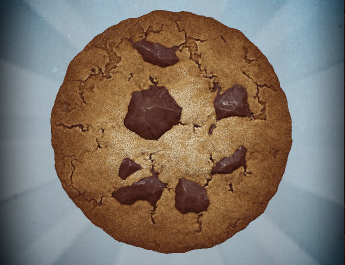

# Warm-Up: Cookie Hacker
Hack some cookies.

>_Note: it is not necessary to fully understand or run all the code here - this warm-up is mainly designed to demonstrate the possibilities of JavaScript!_

## Part Zero: Background
Learn a bit about Cookie Clicker and the JavaScript console.

### Cookie Clicker
[Cookie Clicker](https://sites.google.com/view/cookieclicker-unblocked/) is an [incremental game](https://en.wikipedia.org/wiki/Incremental_game) where the player can click a cookie to get cookies.



This game can be fun, but clicking the cookie over and over again can get a little tiring. There are some upgrades for purchase, but... wouldn't it be sweet to use JavaScript to click the cookie automatically? Yes, yes it would.

This will be possible using the JavaScript console build into Google Chrome.

### The JavaScript Console
Google Chrome (and most browsers) have a way for developers to run JavaScript code on any website. This is a great way for developers to interact with their own websites, or with other websites.

To open the JavaScript Console in Google Chrome, press **Ctrl**+**Shift**+**J**. From there, it will be possible to enter JavaScript commands to run! Because JavaScript is a front-end language, you can use this to run your own code on any website out there.

#### ⚠ WARNING ⚠
Copying and running any code found online can be _extremely dangerous_. If you're going to use the JavaScript console, make sure your code is coming from a trustworthy source.

## Part One: Clicking With Code
Go to [cookie clicker](https://sites.google.com/view/cookieclicker-unblocked/), and open up the JavaScript console by pressing **Ctrl**+**Shift**+**J** to begin.

From there, open the proper inner frame on the site:


There may be a lot of errors that show up, but don't worry about that! All that matters is finding the **>** entry point near the bottom:


There, type in the following command, and press **Enter** to run it:

```js
Game.ClickCookie()
```

The number of cookies should go up! That's because `Game.ClickCookie` is a _function_ in the Cookie Clicker game code, and it is possible to _call_ it.

Press the **Up** key to access the command entry history, and run the command again to click the cookie again. You have officially hacked the Cookie Clicker!

## Part Two: Infinite Clicking
Clicking with code is cool, but it would be even cooler to auto-click quickly. Luckily, this is possible with some advanced JavaScript: the [`setInterval`](https://developer.mozilla.org/en-US/docs/Web/API/setInterval) function.

Type the following into the console, and press **Enter** to run it:

```js
setInterval(Game.ClickCookie, 500);
```

This will _call_ the `Game.ClickCookie` function repeatedly - once every `500` milliseconds! You should be able to watch the number of cookies continue to increase, and bask in the glory of automatic bakery goodness.
